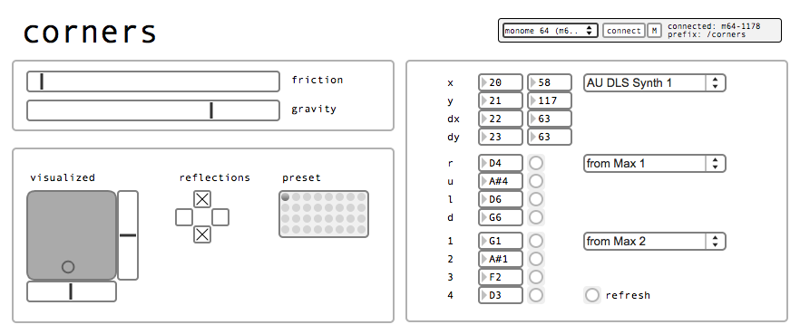

# corners

a grid-controlled patch which lets the user play with gravity and friction. velocities, positions, and border crossings are mapped to sound parameters and events.

this patch can be used several different ways-- i intended it mostly as a drone machine with an organic and playful method to modulate parameters.

created by: tehn

http://vimeo.com/42313896

## instructions

auto-configures for all sizes of grid.

pushing a key on the grid creates an attractor. the "puck" will be drawn towards this point. push multiple keys to create several attractors-- the puck will interact with all at once. the sides of the playing area can be reflective or wrap around based on the checkboxes.

- friction: move to the right to increase friction, which will slow the puck down more rapidly
- gravity: move to the right to increase to power of each key's pull
- visualized: shows the position of the puck and the velocities
- reflections: bounce or wrap, per side
- preset: shift-click to save, click to recall. read/write preset files.

mapping parameters:

- x,y,dx,dy: position and velocity. first col is the CC, second is the current value. you can mouse-change the "current value" which is helpful for auto-mapping from other apps.
- r, u, l, d: right left up down. note events generated when the puck crosses/hits a side of the field. each side has its own note. duration sets note length. "stop" is sends midi panic.
- 1,2,3,4: notes generated according to how many keys are held down. monophonic.

each section above can be on its own output port. this way the two note sets can be sent to different instruments.

this midi tutorial may be helpful:

http://vimeo.com/28742244